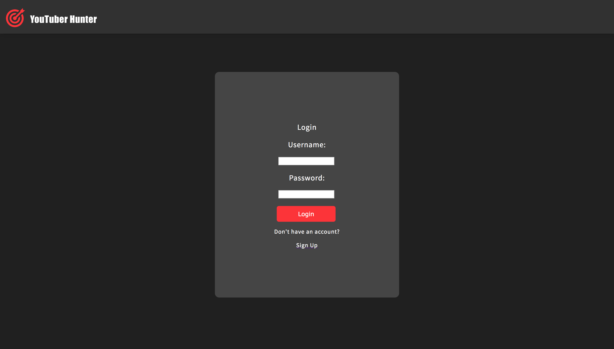
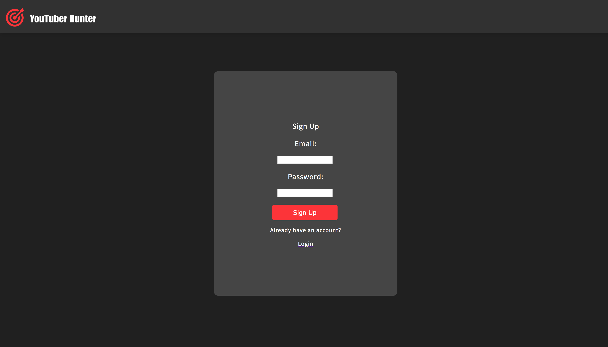
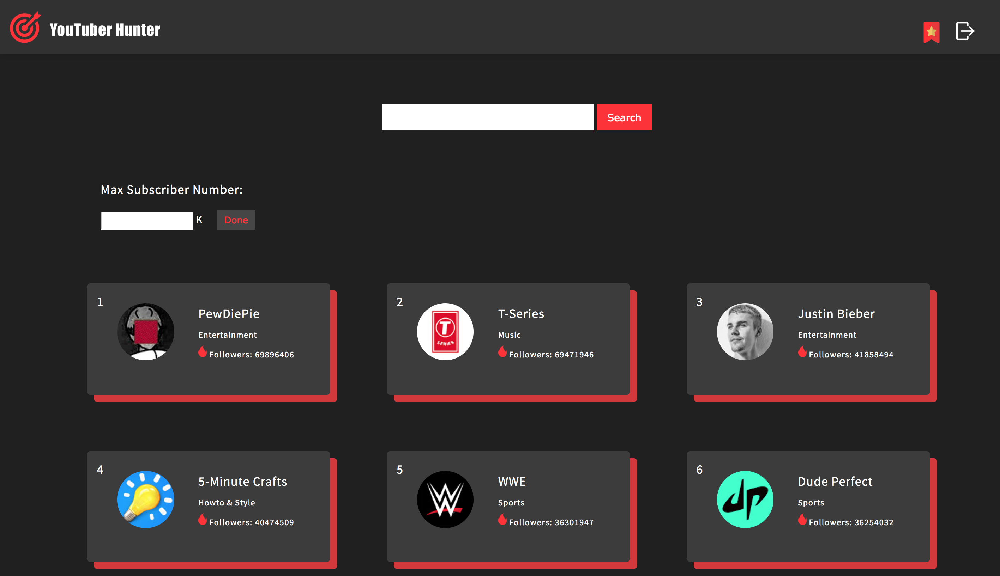
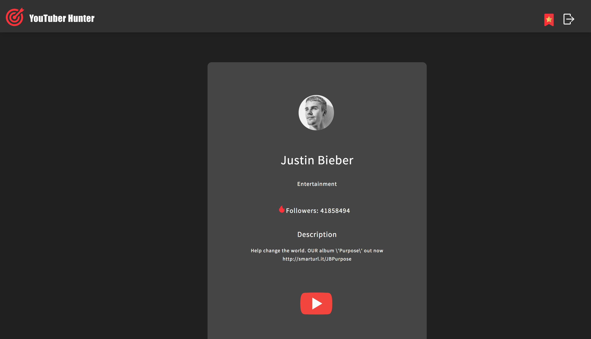
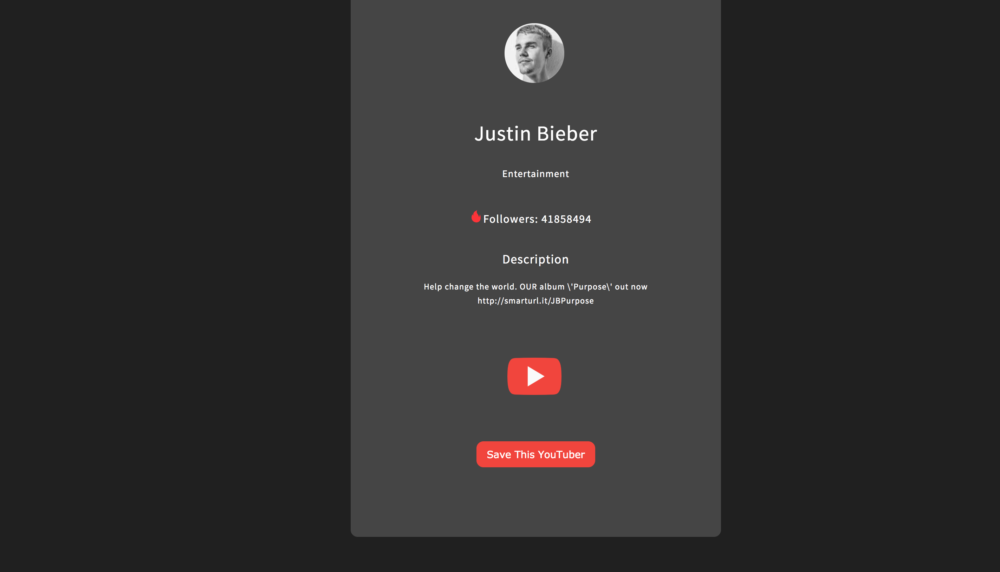
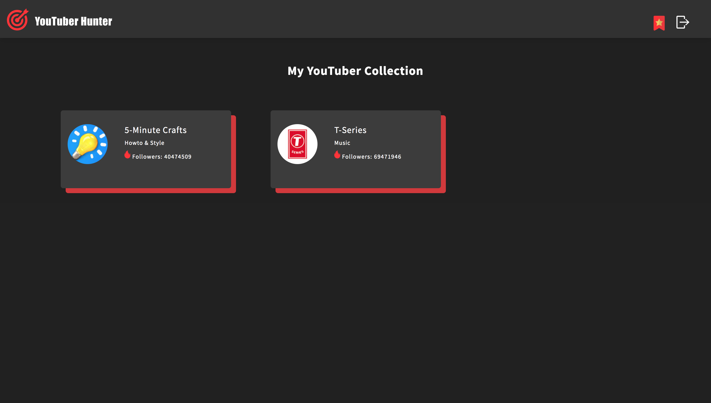
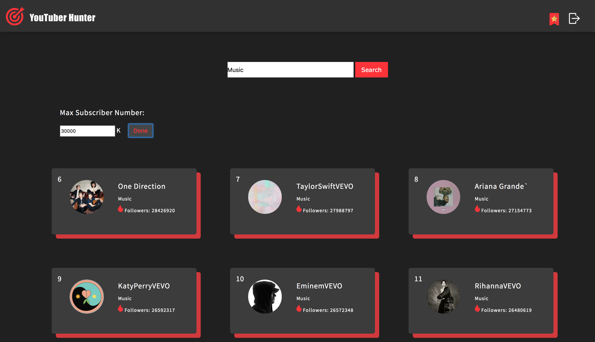
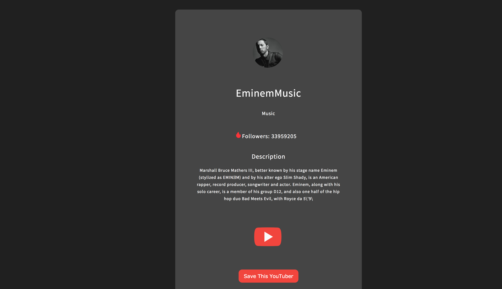
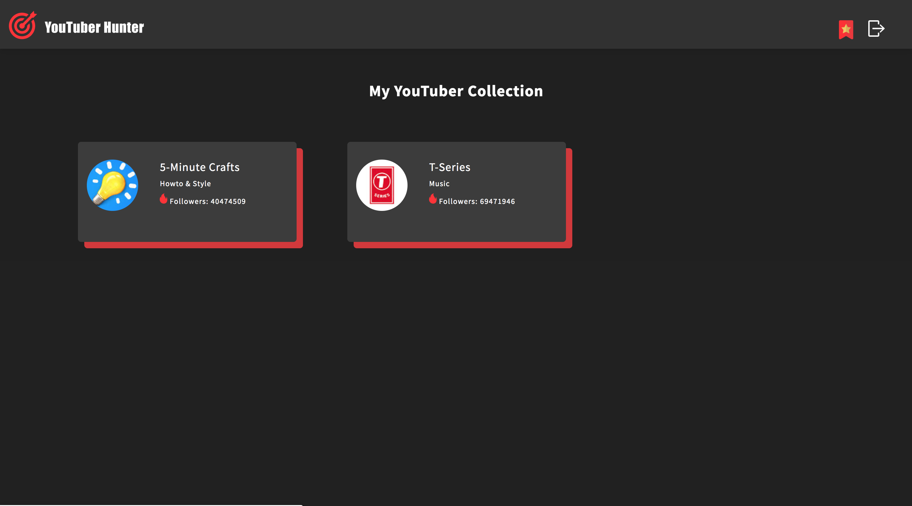

Scenaria:

Our target users are companies/organizations who are seeking YouTubers to promote their products on YouTube channel. On our website, a target user will be able to search YouTubers by their names and channel categories. If the user wants to promote a sport product, he/she cann search "Sports" and get a list of YouTubers who have the greatest number of subscribers. The user can also sort searching results by setting the maximum number of subscribers. Since the bigger number of subscribers is, the more expensive will the promotion be, the user can find YouTubers who provide promotion at a price the user can afford. By clicking on each YouTuber, the user is able to see more details about the YouTuber, such as channel description and the link to the channel, which depending on the YouTuber, can provide the user with the YouTuber's contact information. The user can also save YouTubers he/she intends to connect with to his/her collection. 

UI Screenshots:

UI Improvements:

1.Polished My YouTuber Collection page (bookmark.html). Connected this page with youtube_a.html so that users can see more details of a YouTuber by clicking on a YouTuber box.

2.Added "sort by subscriber number" function to home page so that users can set maximum number of subscribers in their searching.

3.Changed styling of YouTuber boxes to make the visualization more modern.

Data Display Screenshots:

Data Display Explaination:

We used firebase database to store user account information and their favorite list. The way we hook up the firebase to our app is we first made a firstbase database reference, and then use the onclick function to store the user account information to the firebase. For sign up, we just store the username and password to the firebase. For login, we first retrieve the account information from firstbase according to the username, then validate the password.

We use SQLite3 as a tool to store and get the data about YouTubers from the database. In this part, there are several files that relate to accessing the database. The first part is the server.js file. In this file, we handle several get requests which pulling useful data like youtuber category, title, top youtuber, and youtuber id from the database. The second part is the home_company.html file. In this file, we get the real data from the database. Here, we use the ajax call the get the data that we need. The last part is the youtuber_a.html file. At here, we use the searching result from the home_company file that passed here to get the data from the database and fill into the front end page. We also use the ajax call to get the data from the database by get request. 

When users save a YouTuber to their collection, we first store the current username in the session storage. Once the user enter the My YouTuber Collection page, we use the username in the session storage as a reference to retrieve the favorite list from firebase.

Ambitious data display or visualization ideas:

For data display and visualization, we are satisfied with the current list by number of subscribers but we are hoping we could sort the data and list them out using more information to show protential Youtubers but it is hard to find such data, we would need to do some analysis with current data in order to achieve that. As for the Youtuber detail page, it is now displaying Youtuber name, category, number of followers, discription of their channel, link to their channel and the button to save it to personal list. We would hope to display a lot more detailed information in this page like showing their so far most views video and showing them so far most liked videos also since when the channel has been created as well as their recent month follower changing trend to better discribe a channel for our user to evaluate their potential business value.
